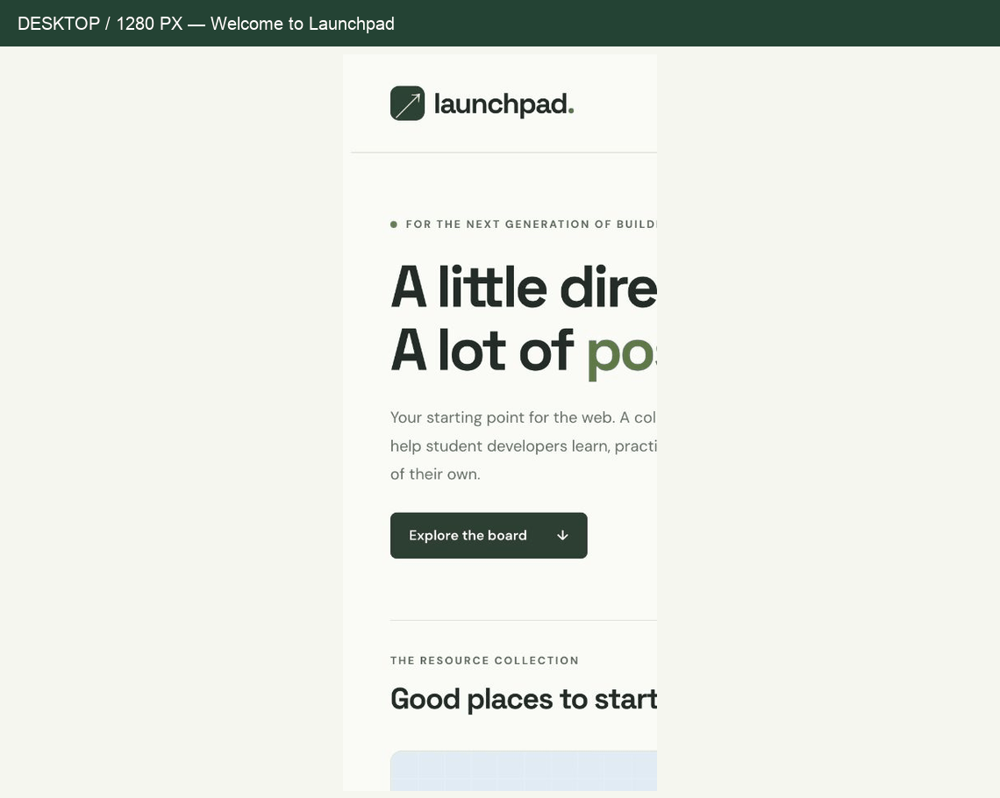

# Web Development Project 1 - Launchpad

Submitted by: **Yudhiishbala V Senthilkumar**

This web app: **Launchpad is a community resource board for student web developers. Twelve curated resources cover web foundations, React, CSS practice, accessibility, and developer tools. Reusable React cards display a description, category, format, and a link to each resource in a responsive grid.**

Time spent: **To be confirmed by the author** hours spent in total

## Required Features

The following **required** functionality is completed:

- [x] **The app has a cohesive, unique theme for events or resources relevant to a specific community**
  - [x] Header/title describing the theme is displayed
- [x] **At least 10 unique events or resources are displayed in a responsive card format**
  - [x] There are at least 10 cards displayed for 10 different events or resources (12 unique resources)
  - [x] The cards should be displayed in an organized format (a responsive CSS grid)
  - [x] Each card should include some information about the event or resource

The following **optional** features are implemented:

- [x] Buttons or links to related resources are on each card component
  - [x] All cards have buttons or links in addition to text
- [x] The site is responsive for both desktop and mobile formats
  - [x] Web app is shown in a mobile format
  - [ ] **Video Walkthrough Special Instructions:** Record the Chrome Developer Tools Toggle Device control switching between desktop and mobile. The included GIF demonstrates actual desktop and mobile browser viewports, but does not show Chrome's Toggle Device UI.

The following **additional** features are implemented:

- [x] Keyboard-accessible skip link and visible focus indicators
- [x] Resource categories and learning-format labels
- [x] Reduced-motion support and descriptive external-link labels
- [x] Original CSS illustrations and a custom favicon

## Video Walkthrough

Here's a walkthrough of implemented required features:



GIF created with **Pillow from actual browser captures at 1280 × 900 and 390 × 844**. This is a sequence of captured interface states, not a continuous screen recording. Screenshots are included in `docs/`.

## Notes

The app was scaffolded with Vite's React template. `ResourceCard` is a functional component that receives a `resource` object and `number` through props. `App` maps twelve resource objects into reusable cards. CSS Grid changes from three columns on desktop to two on tablets and one on phones.

One design challenge was keeping card links aligned despite descriptions of different lengths. A flex-column card body and `margin-top: auto` keep the links at the bottom. Another was keeping the code illustration and header within narrow phone screens; browser checks at 390px and 320px confirmed no horizontal overflow.

AI assistance: Codex drafted the implementation and documentation, checked the rendered interface, and assembled the walkthrough. The code remains deliberately small so its components, props, and responsive CSS can be studied and explained.

### Run locally

Requires Node.js 20.19+ or 22.12+ (a current supported LTS version is recommended).

```bash
npm install
npm run dev
```

```bash
npm run build
npm run lint
```

### Verification

- Production build and lint pass.
- Browser DOM contains 12 resource cards and 12 external resource links.
- Desktop layout checked at 1280 × 900; mobile layout checked at 390 × 844 and 320 × 740.
- No horizontal overflow at the tested sizes; no browser console errors observed.
- The resource-board anchor navigates to the card section.

## License

    Copyright 2026 Yudhiishbala V Senthilkumar

    Licensed under the Apache License, Version 2.0 (the "License");
    you may not use this file except in compliance with the License.
    You may obtain a copy of the License at

        http://www.apache.org/licenses/LICENSE-2.0

    Unless required by applicable law or agreed to in writing, software
    distributed under the License is distributed on an "AS IS" BASIS,
    WITHOUT WARRANTIES OR CONDITIONS OF ANY KIND, either express or implied.
    See the License for the specific language governing permissions and
    limitations under the License.
